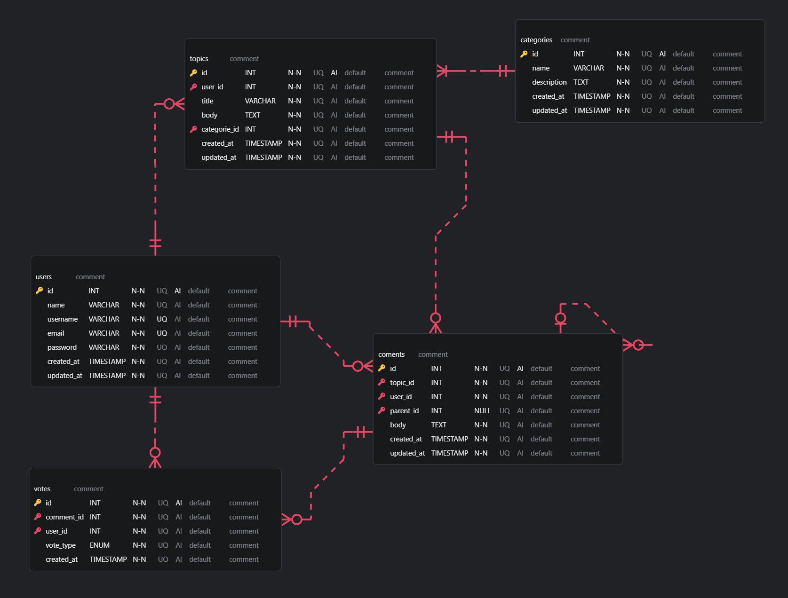

# KitaDiskusi

<p align="center">
    
</p>

Platform diskusi berbasis web yang dirancang untuk memfasilitasi percakapan dan kolaborasi antar pengguna dalam berbagai topik.

## Demo
Anda dapat melihat demo website KitaDiskusi melalui link berikut: [http://kitadiskusi.free.nf](http://kitadiskusi.free.nf)

Mohon diperhatikan bahwa link demo hanya dapat diakses menggunakan protokol http dan tidak dapat diakses melalui https karena menggunakan hosting gratis.

Jika Anda mengalami masalah saat mengakses link demo, silakan laporkan kepada kami agar kami dapat segera memperbaikinya. Terima kasih atas pengertian dan kerjasamanya!

[Video Demo Nya](https://drive.google.com/file/d/1XvYjGuIFWPqxQwkfGajP_WsuHygHgo62/view?usp=sharing)

## Fitur Utama

- **Pembuatan Topik Diskusi**: Pengguna dapat membuat topik diskusi baru
- **Tanggapan**: Setiap diskusi memungkinkan pengguna untuk memberikan tanggapan.
- **Upvote dan Downvote**: Pengguna dapat memberikan suara pada komentar untuk menyoroti kontribusi terbaik.
- **Pencarian Topik**: Fitur pencarian yang memudahkan menemukan diskusi berdasarkan kata kunci atau kategori.

## Teknologi yang Digunakan
- **Frontend**:
    - HTML
    - CSS
    - JS
    - Laravel blade
    - Vite

- **Backend**:
    - Laravel
    - PHP (^8.2)

- **Database**: 
    - Mysql

- **Package Manager**:
    - Composer
    - npm

- **Testing**:
    - PHPUnit

- **Development Tools**:
    - Laravel Tinker
    - Laravel Sail
    - Laravel Pint
    - Faker
    - Mockery
    - Collision

- **JavaScript Libraries**:
    - Axios

- **Build Tools**:
    - Laravel Vite Plugin

- **Hosting**: 
    - InfinityFree (https://www.infinityfree.com/)
    
## Cara Instalasi

1. Clone repositori ini ke komputer Anda:
   
   ```
   git clone https://github.com/Fern-Aerell/KitaDiskusi.git
   ```

2. Masuk ke direktori proyek:
   
   ```
   cd KitaDiskusi
   ```


3. Salin file `.env.example` menjadi `.env`:
   
   ```
   cp .env.example .env
   ```

4. Buat database baru di MySQL untuk proyek ini.

5. Edit file `.env` dan sesuaikan konfigurasi database:
   
   ```
   DB_DATABASE=nama_database_anda
   DB_USERNAME=username_database_anda
   DB_PASSWORD=password_database_anda
   ```

6. Install dependensi PHP menggunakan Composer:
   
   ```
   composer install
   ```

7. Generate kunci aplikasi:
   
   ```
   php artisan key:generate
   ```
   

8. Jalankan migrasi database:
   
   ```
   php artisan migrate
   ```

9. (Opsional) Jalankan seeder untuk mengisi data awal:
   
   ```
   php artisan db:seed
   ```
   

10. Jalankan server development:
    
    ```
    php artisan serve
    ```

11. Buka browser dan akses `http://localhost:8000` untuk melihat aplikasi.

Pastikan Anda telah menginstal PHP, Composer, dan MySQL di komputer Anda sebelum memulai instalasi.

## Desain ERD



## Nama-nama anggota

- [Fern Aerell](https://github.com/Fern-Aerell)
- [Nico Ferdy Hutajulu](https://github.com/NewX-Team)
- [Habib Asyrof](https://github.com/HabibAsyrof)
- [Kurnia Husnul Khatimah](https://github.com/kurniaaa01)

## Video Presentasi

- [Fern Aerell](https://drive.google.com/file/d/1dYb0j8x31IpIaxB0_gfA6e01eF8sr2WX/view?usp=sharing)
- [Nico Ferdy Hutajulu](https://drive.google.com/file/d/1dYb0j8x31IpIaxB0_gfA6e01eF8sr2WX/view?usp=sharing)
- [Habib Asyrof](https://drive.google.com/file/d/1dYb0j8x31IpIaxB0_gfA6e01eF8sr2WX/view?usp=sharing)
- [Kurnia Husnul Khatimah](https://drive.google.com/file/d/1dYb0j8x31IpIaxB0_gfA6e01eF8sr2WX/view?usp=sharing)
