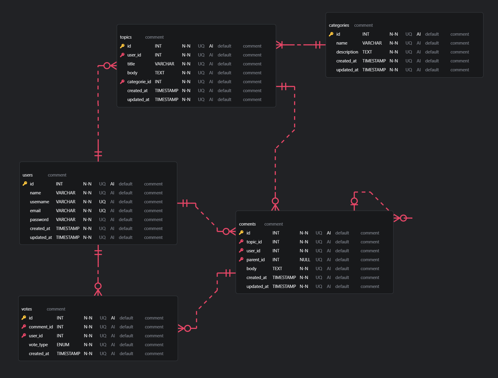

# KitaDiskusi

<p align="center">
    
</p>

A web-based discussion platform designed to facilitate conversations and collaboration among users on various topics.

## Demo
You can view the KitaDiskusi website demo through the following link: [http://kitadiskusi.free.nf](http://kitadiskusi.free.nf)

Please note that the demo link can only be accessed using the HTTP protocol and cannot be accessed through HTTPS due to free hosting limitations.

If you encounter any issues accessing the demo link, please report them to us so we can fix them promptly. Thank you for your understanding and cooperation!

[Demo Video](https://drive.google.com/file/d/1XvYjGuIFWPqxQwkfGajP_WsuHygHgo62/view?usp=sharing)

## Key Features

- **Create Discussion Topics**: Users can create new discussion topics.
- **Replies**: Each discussion allows users to provide replies.
- **Upvote and Downvote**: Users can vote on comments to highlight the best contributions.
- **Topic Search**: A search feature to easily find discussions based on keywords or categories.

## Technologies Used
- **Frontend**:
    - HTML
    - CSS
    - JS
    - Laravel Blade
    - Vite

- **Backend**:
    - Laravel
    - PHP (^8.2)

- **Database**:
    - MySQL

- **Package Manager**:
    - Composer
    - npm

- **Testing**:
    - PHPUnit

- **Development Tools**:
    - Laravel Tinker
    - Laravel Sail
    - Laravel Pint
    - Faker
    - Mockery
    - Collision

- **JavaScript Libraries**:
    - Axios

- **Build Tools**:
    - Laravel Vite Plugin

- **Hosting**: 
    - InfinityFree (https://www.infinityfree.com/)
    
## Installation Instructions

1. Clone this repository to your local machine:
   
   ```
   git clone https://github.com/Fern-Aerell/KitaDiskusi.git
   ```

2. Navigate to the project directory:
   
   ```
   cd KitaDiskusi
   ```

3. Copy the `.env.example` file to `.env`:
   
   ```
   cp .env.example .env
   ```

4. Create a new MySQL database for this project.

5. Edit the `.env` file and adjust the database configuration:
   
   ```
   DB_DATABASE=your_database_name
   DB_USERNAME=your_database_username
   DB_PASSWORD=your_database_password
   ```

6. Install PHP dependencies using Composer:
   
   ```
   composer install
   ```

7. Generate the application key:
   
   ```
   php artisan key:generate
   ```

8. Run the database migrations:
   
   ```
   php artisan migrate
   ```

9. (Optional) Run the seeder to populate initial data:
   
   ```
   php artisan db:seed
   ```

10. Start the development server:
    
    ```
    php artisan serve
    ```

11. Open your browser and go to `http://localhost:8000` to view the application.

Make sure you have PHP, Composer, and MySQL installed on your machine before starting the installation.

## ERD Design



## Team Members

- [Fern Aerell](https://github.com/Fern-Aerell)
- [Nico Ferdy Hutajulu](https://github.com/NewX-Team)
- [Habib Asyrof](https://github.com/HabibAsyrof)
- [Kurnia Husnul Khatimah](https://github.com/kurniaaa01)

## Presentation Videos

- [Fern Aerell](https://drive.google.com/file/d/1dYb0j8x31IpIaxB0_gfA6e01eF8sr2WX/view?usp=sharing)
- [Nico Ferdy Hutajulu](https://drive.google.com/file/d/1dYb0j8x31IpIaxB0_gfA6e01eF8sr2WX/view?usp=sharing)
- [Habib Asyrof](https://drive.google.com/file/d/1dYb0j8x31IpIaxB0_gfA6e01eF8sr2WX/view?usp=sharing)
- [Kurnia Husnul Khatimah](https://drive.google.com/file/d/1dYb0j8x31IpIaxB0_gfA6e01eF8sr2WX/view?usp=sharing)
